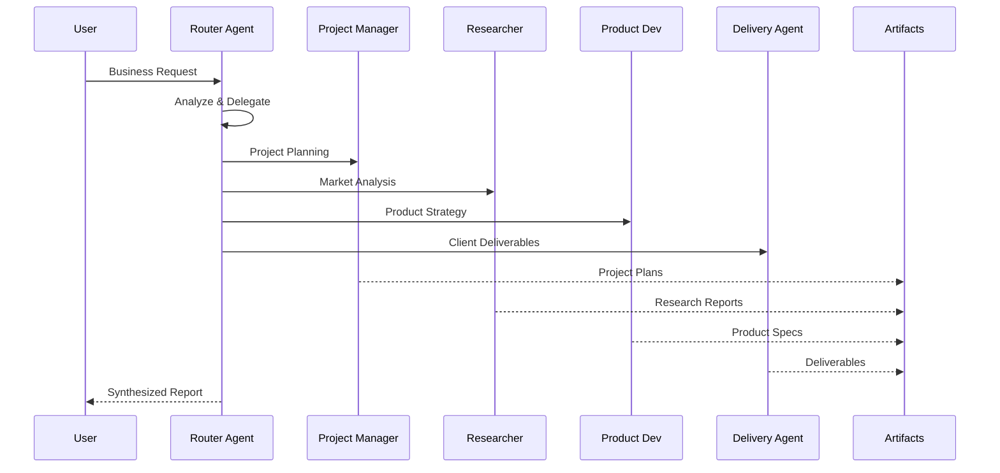

# Emerson AI Workspace

Language: [English](README.md) | [Nederlands](README_NL.md)


Welcome to the **Emerson AI Workspace** - an enterprise-grade autonomous agent platform designed for business operations. Built on Google Antigravity with a specialized multi-agent architecture for **Project Management**, **Research**, **Product Development**, and **Service Delivery**.

## Business Focus Areas

| Domain | Agent | Purpose |
|--------|-------|---------|
| **Project Management** | ProjectManagerAgent | Planning, tracking, resource allocation, timeline management |
| **Research** | ResearcherAgent | Market research, competitive analysis, trend analysis |
| **Product Development** | ProductDevAgent | Product strategy, roadmaps, feature planning, MVP design |
| **Service Delivery** | DeliveryAgent | Client deliverables, quality assurance, documentation |

## Core Philosophy

### Think-Act-Reflect Loop

Every Emerson agent follows a structured approach:



### Artifact-First Protocol

Emerson agents produce tangible outputs for every task:

1. **Planning**: `artifacts/plans/` - Project plans, roadmaps, strategies
2. **Research**: `artifacts/research/` - Market analysis, competitive reports
3. **Deliverables**: `artifacts/deliverables/` - Client-ready documents
4. **Logs**: `artifacts/logs/` - Progress tracking, decision logs

## Quick Start

### Local Development
```bash
# Install dependencies
pip install -r requirements.txt

# Run the main agent
python src/agent.py

# Run the multi-agent swarm
python -m src.swarm_demo
```

### Docker Deployment
```bash
docker-compose up --build
```

## Project Structure

```
emerson-workspace/
├── .antigravity/           # AI Configuration
│   └── rules.md           # Emerson Agent Persona & Directives
├── .context/               # Business Knowledge Base
│   ├── system_prompt.md   # Core AI Instructions
│   ├── coding_style.md    # Development Standards
│   └── business_context.md # Emerson Business Rules
├── artifacts/              # Agent Outputs
│   ├── plans/             # Project Plans & Roadmaps
│   ├── research/          # Research Reports
│   ├── deliverables/      # Client Deliverables
│   └── logs/              # Progress Logs
├── src/
│   ├── agent.py           # Main Agent Logic
│   ├── swarm.py           # Multi-Agent Orchestration
│   ├── config.py          # Settings Management
│   ├── memory.py          # Persistent Memory
│   ├── agents/            # Specialist Agents
│   │   ├── router_agent.py
│   │   ├── project_manager_agent.py
│   │   ├── researcher_agent.py
│   │   ├── product_dev_agent.py
│   │   └── delivery_agent.py
│   └── tools/             # Business Tools
├── tests/                  # Test Suite
├── mission.md             # Current Business Objective
└── docker-compose.yml     # Container Setup
```

## Specialist Agents

### Project Manager Agent
Handles all project management tasks:
- Sprint planning & backlog management
- Resource allocation & capacity planning
- Timeline management & milestone tracking
- Risk assessment & mitigation
- Stakeholder communication

### Researcher Agent
Conducts business research:
- Market analysis & trends
- Competitive intelligence
- Customer insights
- Technology assessment
- Industry reports

### Product Development Agent
Manages product lifecycle:
- Product strategy & vision
- Feature prioritization
- Roadmap planning
- MVP definition
- User story creation

### Delivery Agent
Ensures quality service delivery:
- Deliverable preparation
- Quality assurance
- Documentation
- Client communication
- Handoff management

## Features

### Infinite Memory Engine
Recursive summarization ensures no context is lost, even across long business engagements.

### Auto Tool Discovery
Drop business tools into `src/tools/` and they're automatically available:

```python
# src/tools/project_tools.py
def create_project_plan(
    project_name: str,
    objectives: list[str],
    timeline_weeks: int
) -> str:
    """Creates a structured project plan.

    Args:
        project_name: Name of the project.
        objectives: List of project objectives.
        timeline_weeks: Project duration in weeks.

    Returns:
        Formatted project plan document.
    """
    # Implementation
    pass
```

### Auto Context Loading
Add business knowledge to `.context/` for automatic injection:

```bash
# Add client-specific context
echo "# Client: ACME Corp\nIndustry: Manufacturing" > .context/client_acme.md
```

### MCP Integration
Connect to external business tools via Model Context Protocol:
- **GitHub**: Repository management
- **Slack**: Team communication
- **PostgreSQL**: Data access
- **Brave Search**: Market research

## Configuration

### Environment Variables
```bash
# .env
GOOGLE_API_KEY=your_gemini_api_key
MCP_ENABLED=true
OPENAI_BASE_URL=https://api.openai.com/v1  # Optional: for hybrid LLM
```

### MCP Servers
Configure business integrations in `mcp_servers.json`:
```json
{
  "servers": [
    {
      "name": "github",
      "transport": "stdio",
      "command": "npx",
      "args": ["-y", "@modelcontextprotocol/server-github"],
      "enabled": true
    }
  ]
}
```

## Usage Examples

### Project Planning
```python
from src.swarm import SwarmOrchestrator

swarm = SwarmOrchestrator()
result = swarm.execute(
    "Create a project plan for launching a new SaaS product in Q2"
)
```

### Market Research
```python
result = swarm.execute(
    "Research the competitive landscape for AI-powered project management tools"
)
```

### Product Development
```python
result = swarm.execute(
    "Define MVP features for a customer feedback portal"
)
```

### Service Delivery
```python
result = swarm.execute(
    "Prepare client deliverables for the website redesign project"
)
```

## Roadmap

- [x] **Phase 1**: Foundation (Scaffold, Config, Memory)
- [x] **Phase 2**: DevOps (Docker, CI/CD)
- [x] **Phase 3**: Business Agent Architecture
- [x] **Phase 4**: Multi-Agent Swarm
- [x] **Phase 5**: MCP Integration
- [ ] **Phase 6**: Advanced Analytics Dashboard
- [ ] **Phase 7**: Client Portal Integration
- [ ] **Phase 8**: Automated Reporting

## Testing

```bash
# Run all tests
pytest tests/

# Run specific test suite
pytest tests/test_swarm.py
```

## License

MIT License - See [LICENSE](LICENSE) for details.

---

**Emerson AI Workspace** - Empowering Business Through Intelligent Automation
